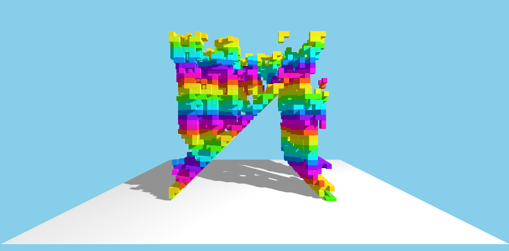

# Game of Life Visualiser


This is a visualiser for Conway's Game of Life with looparound... **NOW IN 3D!!**

The vertical axis + colours represent time.

Supports importing and exporting states!

**Enjoy!**

# Gallery

Some interesting configurations.

Screenshot
```json
{"seed":"////////","x":32,"y":32,"depth":32,"name":"Game of Life Visualiser"}
```

2 Rings Explosion
```json
{"seed":"AAAAAAAAAAAAAAAAAAAAAAAAAAAAAAAAAAAAAAAAAAAAAAAAAAAAAAAAAAAAAAAAAAAAAAAHAAAABQAAAAcAAAAAAAAABwAAAAUAAAAHAAAAAAAAAAAAAAAAAAAAAAAAAAAAAAAAAAAAAAAAAAAAAAAAAAAAAAAAAAAAAAAAAAA=","x":32,"y":32,"depth":64,"name":"Game of Life Visualiser"}
```
